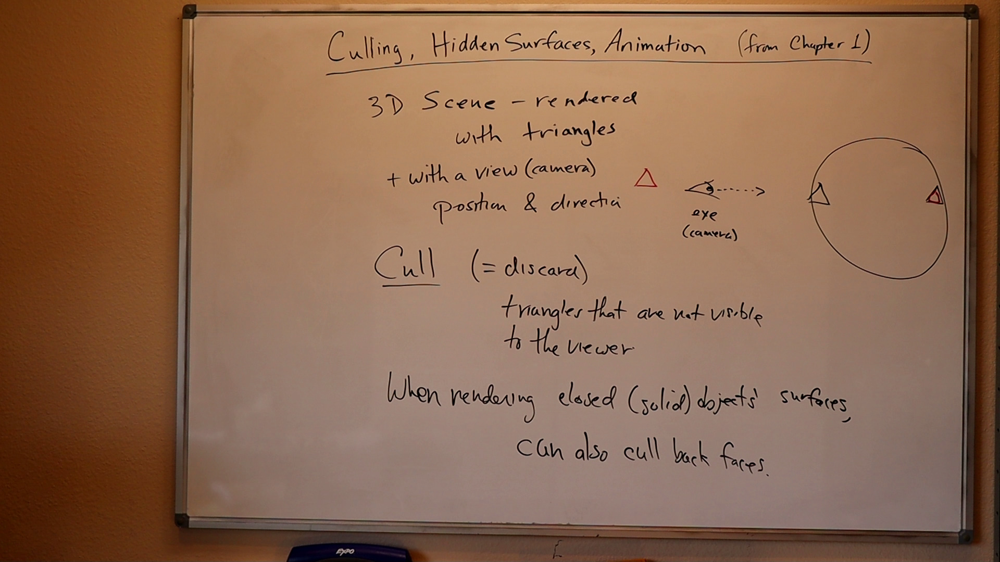

# [11/04/2023] learning Computer Graphics

Right-Hand is the World 
Left-hand is the Eye

CPU - Central Processing Unit

## GPU (Graphics Processing Unit)
Modern day computer has dedicated Graphics Processing Unit (GPU) to produce
images for the display, with its own graphics memory (or Video RAM or VRAM).

The GPU writes the color value into the frame buffer. The display reads the
color values from the frame buffer row-by-row, from left-to-right,
top-to-bottom, and puts each of the values onto the screen. This is known as
raster-scan.

## Colors
### Color Depth [Wiki](https://w.wiki/83cN) 

## Pixels and Frame
All modern displays are raster-based. A raster is a 2D rectangular grid of
pixels (or picture elements). A pixel has two properties: a color and a
position. Color is expressed in RGB (Red-Green-Blue) components - typically 8
bits per component or 24 bits per pixel (or true color). The position is
expressed in terms of (x, y) coordinates. The origin (0, 0) is located at the
top-left corner, with x-axis pointing right and y-axis pointing down. This is
different from the conventional 2D Cartesian coordinates, where y-axis is
pointing upwards.

The number of color-bits per pixel is called the depth (or precision) of the
display. The number of rows by columns of the rectangular grid is called the
resolution of the display, which can range from 640x480 (VGA), 800x600 (SVGA),
1024x768 (XGA) to 1920x1080 (FHD), or even higher.

## Frame Buffer and Refresh Rate
The color values of the pixels are stored in a special part of graphics memory
called frame buffer. The GPU writes the color value into the frame buffer. The
display reads the color values from the frame buffer row-by-row, from
left-to-right, top-to-bottom, and puts each of the values onto the screen. This
is known as raster-scan. The display refreshes its screen several dozen times
per second, typically 60Hz for LCD monitors and higher for CRT tubes. This is
known as the refresh rate.

A complete screen image is called a frame.

## Double Buffering and VSync
While the display is reading from the frame buffer to display the current
frame, we might be updating its contents for the next frame (not necessarily in
raster-scan manner). This would result in the so-called tearing, in which the
screen shows parts of the old frame and parts of the new frame.

This could be resolved by using so-called double buffering. Instead of using a
single frame buffer, modern GPU uses two of them: a front buffer and a back
buffer. The display reads from the front buffer, while we can write the next
frame to the back buffer. When we finish, we signal to GPU to swap the front
and back buffer (known as buffer swap or page flip).

Double buffering alone does not solve the entire problem, as the buffer swap
might occur at an inappropriate time, for example, while the display is in the
middle of displaying the old frame. This is resolved via the so-called vertical
synchronization (or VSync) at the end of the raster-scan. When we signal to the
GPU to do a buffer swap, the GPU will wait till the next VSync to perform the
actual swap, after the entire current frame is displayed.

The most important point is: When the VSync buffer-swap is enabled, you cannot
refresh the display faster than the refresh rate of the display!!! For the
LCD/LED displays, the refresh rate is typically locked at 60Hz or 60 frames per
second, or 16.7 milliseconds for each frame. Furthermore, if you application
refreshes at a fixed rate, the resultant refresh rate is likely to be an
integral factor of the display's refresh rate, i.e., 1/2, 1/3, 1/4, etc.

## 3D Graphics rendering pipeline
 

The 3D graphics rendering pipeline consists of the following main stages:

**Vertex Processing** : Process and transform individual vertices.
**Rasterization** : Convert each primitive (connected vertices) into a set of
fragments. A fragment can be treated as a pixel in 3D spaces, which is aligned
with the pixel grid, with attributes such as position, color, normal and
texture.
**Fragment Processing** : Process individual fragments.
**Output Merging** : Combine the fragments of all primitives (in 3D space) into 2D
color-pixel for the display.

In modern GPUs, the vertex processing stage and fragment processing stage are
programmable. You can write programs, known as vertex shader and fragment
shader to perform your custom transform for vertices and fragments. The shader
programs are written in C-like high level languages such as GLSL (OpenGL
Shading Language), HLSL (High-Level Shading Language for Microsoft Direct3D),
or Cg (C for Graphics by NVIDIA).

On the other hand, the rasterization and output merging stages are not
programmable, but configurable - via configuration commands issued to the GPU.

## Vertices, Primitives, Fragment and Pixels
A primitive is made up of one or more vertices.

### 3D graphics coordinate system
OpenGL adopts the Right-Hand Coordinate System (RHS). In the RHS, the x-axis is
pointing right, y-axis is pointing up, and z-axis is pointing out of the
screen. With your right-hand fingers curving from the x-axis towards the
y-axis, the thumb is pointing at the z-axis. RHS is counter-clockwise (CCW).
The 3D Cartesian Coordinates is a RHS.

Some graphics software (such as Microsoft Direct3D) use Left-hand System (LHS),
where the z-axis is inverted. LHS is clockwise (CW).

 
### Vertices
A vertex, in computer graphics, has these attributes:
- position in 3D space V=(x,y,z): typically expressed in floating point numbers.
- color: expressed in RGB or RGBA components. typically normalized to 0.0 to
  1.0 (or 8-bit unsigned integer between 0 and 255). Alpha is used to specify
  the transparency.
- vertex-normal: N=(nx,ny,nz): Normals are used to differentiate the front- and
  back-face, and for other processing such as lighting.
- texture
- some more...

Note:
in OpenGL, using the RHS. The normal is pointing outwards, indicating the outer surface (or front-face).

#### OpenGL Primitives and Vertices

 

To create a geometric object or model, we use a pair of glBegin(PrimitiveType)
and glEnd() to enclose the vertices that form the model. For primitiveType that
ends with 'S' (e.g., GL_QUADS), we can define multiple shapes of the same type.

Each of the 6 faces is a primitive quad (GL_QUAD). We first set the color via
glColor3f(red, green, blue). This color would be applied to all subsequent
vertices until it is overridden. The 4 vertices of the quad are specified via
glVertex3f(x, y, z), in counter-clockwise manner such that the surface-normal
is pointing outwards, indicating its front-face. All four vertices has this
surface-normal as its vertex-normal.

Example: create a model in OpenGL
```
glBegin(GL_QUADS); // of the color cube
   // Top-face
   glColor3f(0.0f, 1.0f, 0.0f); // green
   glVertex3f(1.0f, 1.0f, -1.0f);
   glVertex3f(-1.0f, 1.0f, -1.0f);
   glVertex3f(-1.0f, 1.0f, 1.0f);
   glVertex3f(1.0f, 1.0f, 1.0f);
 
   // Bottom-face
   glColor3f(1.0f, 0.5f, 0.0f); // orange
   glVertex3f(1.0f, -1.0f, 1.0f);
   glVertex3f(-1.0f, -1.0f, 1.0f);
   glVertex3f(-1.0f, -1.0f, -1.0f);
   glVertex3f(1.0f, -1.0f, -1.0f);
 
   // Front-face
   glColor3f(1.0f, 0.0f, 0.0f); // red
   glVertex3f(1.0f, 1.0f, 1.0f);
   glVertex3f(-1.0f, 1.0f, 1.0f);
   glVertex3f(-1.0f, -1.0f, 1.0f);
   glVertex3f(1.0f, -1.0f, 1.0f);
 
   // Back-face
   glColor3f(1.0f, 1.0f, 0.0f); // yellow
   glVertex3f(1.0f, -1.0f, -1.0f);
   glVertex3f(-1.0f, -1.0f, -1.0f);
   glVertex3f(-1.0f, 1.0f, -1.0f);
   glVertex3f(1.0f, 1.0f, -1.0f);
 
   // Left-face
   glColor3f(0.0f, 0.0f, 1.0f); // blue
   glVertex3f(-1.0f, 1.0f, 1.0f);
   glVertex3f(-1.0f, 1.0f, -1.0f);
   glVertex3f(-1.0f, -1.0f, -1.0f);
   glVertex3f(-1.0f, -1.0f, 1.0f);
 
   // Right-face
   glColor3f(1.0f, 0.0f, 1.0f); // magenta
   glVertex3f(1.0f, 1.0f, -1.0f);
   glVertex3f(1.0f, 1.0f, 1.0f);
   glVertex3f(1.0f, -1.0f, 1.0f);
   glVertex3f(1.0f, -1.0f, -1.0f);
glEnd(); // of the color cube
```

#### Indexed Vertices
Primitives often share vertices. Instead of repeatedly specifying the vertices,
it is more efficient to create an index list of vertices, and use the indexes
in specifying the primitives.

For example, the following code fragment specifies a pyramid, which is formed
by 5 vertices. We first define 5 vertices in an index array, followed by their
respectively color. For each of the 5 faces, we simply provide the vertex index
and color index.

```
float[] vertices = { // 5 vertices of the pyramid in (x,y,z)
  -1.0f, -1.0f, -1.0f,  // 0. left-bottom-back
   1.0f, -1.0f, -1.0f,  // 1. right-bottom-back
   1.0f, -1.0f,  1.0f,  // 2. right-bottom-front
  -1.0f, -1.0f,  1.0f,  // 3. left-bottom-front
   0.0f,  1.0f,  0.0f   // 4. top
};
          
float[] colors = {  // Colors of the 5 vertices in RGBA
   0.0f, 0.0f, 1.0f, 1.0f,  // 0. blue
   0.0f, 1.0f, 0.0f, 1.0f,  // 1. green
   0.0f, 0.0f, 1.0f, 1.0f,  // 2. blue
   0.0f, 1.0f, 0.0f, 1.0f,  // 3. green
   1.0f, 0.0f, 0.0f, 1.0f   // 4. red
};
  
byte[] indices = { // Vertex indices of the 4 Triangles
   2, 4, 3,   // front face (CCW)
   1, 4, 2,   // right face
   0, 4, 1,   // back face
   4, 0, 3    // left face
};
 
// Transfer the arrays to vertex-buffer, color-buffer and index-buffer.
// Draw the primitives (triangle) from the index buffer
```

### Pixel vs. Fragment
Pixels refers to the dots on the display, which are aligned in a 2-dimensional
grid of a certain rows and columns corresponding to the display's resolution. A
pixel is 2-dimensional, with a (x, y) position and a RGB color value (there is
no alpha value for pixels). The purpose of the Graphics Rendering Pipeline is
to produce the color-value for all the pixels for displaying on the screen,
given the input primitives.

 

In order to produce the grid-aligned pixels for the display, the rasterizer of
the graphics rendering pipeline, as its name implied, takes each input
primitive and perform raster-scan to produce a set of grid-aligned fragments
enclosed within the primitive. A fragment is 3-dimensional, with a (x, y, z)
position. The (x, y) are aligned with the 2D pixel-grid. The z-value (not
grid-aligned) denotes its depth. The z-values are needed to capture the
relative depth of various primitives, so that the occluded objects can be
discarded (or the alpha channel of transparent objects processed) in the
output-merging stage.

Fragments are produced via interpolation of the vertices. Hence, a fragment has
all the vertex's attributes such as color, fragment-normal and texture
coordinates.

In modern GPU, vertex processing and fragment processing are programmable. The
programs are called vertex shader and fragment shader.

Note: (Direct3D uses the term "pixel" for "fragment".)

## Vertex Processing
The process used to produce a 3D scene on the display in Computer Graphics is
like taking a photograph with a camera. It involves four transformations:

1. Arrange the objects (or models, or avatar) in the world (Model Transformation or World transformation).
2. Position and orientation the camera (View transformation).
3. Select a camera lens (wide angle, normal or telescopic), adjust the focus length and zoom factor to set the camera's field of view (Projection transformation).
4. Print the photo on a selected area of the paper (Viewport transformation) - in rasterization stage

 

A transform converts a vertex V from one space (or coordinate system) to
another space V'. In computer graphics, transform is carried by multiplying the
vector with a transformation matrix, i.e., V' = M V.

### Model Transform (or Local Transform, or World Transform)
 

Each object (or model or avatar) in a 3D scene is typically drawn in its own
coordinate system, known as its model space (or local space, or object space).
As we assemble the objects, we need to transform the vertices from their local
spaces to the world space, which is common to all the objects. This is known as
the world transform.

The world transform consists of a series of scaling (scale the object to match
the dimensions of the world), rotation (align the axes), and translation (move
the origin).

Rotation and scaling belong to a class of transformation called linear
transformation (by definition, a linear transformation preserves vector
addition and scalar multiplication). Linear transform and translation form the
so-called affine transformation. Under an affine transformation, a straight
line remains a straight line and ratios of distances between points are
preserved.

Note:
In OpenGL, a vertex V at (x,y,z) is represented as a 3x1 column vector.
    |x|
V = |y|
    |z|

Other systems, such as Direct3D, use a row vector to represent a vertex.

**Scaling** 
3D scaling can be represented in a 3x3 matrix:

```
                |ax 0  0 |
S(ax,ay,az) =   |0  ay 0 |
                |0  0  az|
```

 

where ax, ay and az represent the scaling factors in x, y and z direction,
respectively. If all the factors are the same, it is called uniform scaling.

We can obtain the transformed result V' of vertex V via matrix multiplication, as follows:

```
            |ax 0  0 | |x|   |axx|
V' = SV =   |0  ay 0 | |y| = |ayy|
            |0  0  az| |z|   |azz|
```

 

**Rotation** 
3D rotation operates about an axis of rotation (2D rotation operates about a
center of rotation). 3D Rotations about the x, y and z axes for an angle θ
(measured in counter-clockwise manner) can be represented in the following 3x3
matrices:
 

The rotational angles about x, y and z axes, denoted as θx, θy and θz, are
known as Euler angles, which can be used to specify any arbitrary orientation
of an object. The combined transform is called Euler transform.

**Translation** 
Translation does not belong to linear transform, but can be modeled via a
vector addition, as follows:


Fortunately, we can represent translation using a 4x4 matrices and obtain the
transformed result via matrix multiplication, if the vertices are represented
in the so-called 4-component homogeneous coordinates (x, y, z, 1), with an
additional forth w-component of 1. We shall describe the significance of the
w-component later in projection transform. In general, if the w-component is
not equal to 1, then (x, y, z, w) corresponds to Cartesian coordinates of
(x/w, y/w, z/w). If w=0, it represents a vector, instead of a point (or vertex).

Using the 4-component homogeneous coordinates, translation can be represented
in a 4x4 matrix, as follows:
 

The transformed vertex V' can again be computed via matrix multiplication:
 

**Summary of Affine Transformations** 
We rewrite the scaling and rotation into 4x4 matrices using the homogenous
coordinates.
 

**Successive Transforms** 
A series of successive affine transforms (T1, T2, T3, ...) operating on a vertex V
can be computed via concatenated matrix multiplications V' = ...T3 T2 T1 V

The matrices can be combined before applying to the vertex because matrix
multiplication is associative, i.e., T3 (T2 (T1 V) ) = (T3 T2 T1) V

**Transformation of Vertex-Normal** 
Recall that a vector has a vertex-normal, in addition to (x, y, z) position and color.

Suppose that M is a transform matrix, it can be applied to vertex-normal only
if the transforms does not include non-uniform scaling. Otherwise, the
transformed normal will not be orthogonal to the surface. For non-uniform
scaling, we could use (M^-1)^T as the transform matrix, which ensure that the
transformed normal remains orthogonal.

### View Transform
After the world transform, all the objects are assemble into the world space.
We shall now place the camera to capture the view.
 

## OpenGL
API for c++ program to do graphics in conjunction with a GPU.

GPU - may have 1000's cores - run small programs called shaders.

some alternatives:
- DirectX(M$), Metal (Apple), Vulkan...

## OpenGL common usecase 
CPU
c++ program
draw shape (triangles, lines, or points)
specify vertices (points in R3)
specify how to transform 3D to 2D image using matrices (4x4)
specify other vertex attributes such as color, coordinate, or texture
give DrawCommand

GPU
(run first) Vertex Shaders - a program that run on every vertex
Fragment Shaders (Pixel Shaders) - a program that run on each pixel inside each
shape boundary (triangle, line..)

### Points, Lines, & Triangle
create a array for vertices
float vertex[][2] = {
    {2,1},
    {2,2},
    {0,2}
};

load the array into the GPU (OpenGL, Vulkan..)
use the command api like glDrawArrays(GL_POINTS, 0, 3)

### Draw
given 6 vertices
run command glDrawArrays(MODE, 0, 6)

### Draw a line
Draw modes
GL_LINES - create line between each pairs of vertices {v0, v1} {v2, v3} {v4, v5}
GL_LINE_STRIP - create line between {v1, v2} {v3, v4} plus lines from GL_LINES
GL_LINE_LOOP - create line between {v0, v5} plus GL_LINE_STRIP
 

### Draw a triangle
tell openGL to handle different logic by faces.
The side of shape is define looking at the "Front" faces of triangle when going
counter-clockwise; the "Back" faces is going clockwise.

Draw modes
GL_TRIANGLES - create triangles {v0, v1, v2} {v3, v4, v5}
 

GL_TRIANGLE_FAN
 

GL_TRIANGLE_STRIP
 

Example
 

### Culling, Hidden Surface Algorithms, Animation
 
 
 
 
 

