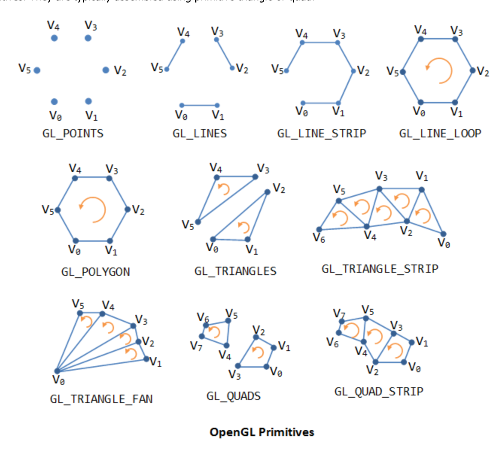

# [11/04/2023] learning Computer Graphics

CPU - Central Processing Unit

GPU - Graphics Processing Unit
The GPU writes the color value into the frame buffer. The display reads the
color values from the frame buffer row-by-row, from left-to-right,
top-to-bottom, and puts each of the values onto the screen. This is known as
raster-scan.

## 3D Graphics rendering pipeline
 

The 3D graphics rendering pipeline consists of the following main stages:

**Vertex Processing** : Process and transform individual vertices.
**Rasterization** : Convert each primitive (connected vertices) into a set of
fragments. A fragment can be treated as a pixel in 3D spaces, which is aligned
with the pixel grid, with attributes such as position, color, normal and
texture.
**Fragment Processing** : Process individual fragments.
**Output Merging** : Combine the fragments of all primitives (in 3D space) into 2D
color-pixel for the display.

In modern GPUs, the vertex processing stage and fragment processing stage are
programmable. You can write programs, known as vertex shader and fragment
shader to perform your custom transform for vertices and fragments. The shader
programs are written in C-like high level languages such as GLSL (OpenGL
Shading Language), HLSL (High-Level Shading Language for Microsoft Direct3D),
or Cg (C for Graphics by NVIDIA).

On the other hand, the rasterization and output merging stages are not
programmable, but configurable - via configuration commands issued to the GPU.

## Vertices, Primitives, Fragment and Pixels

 

### 3D graphics coordinate system
OpenGL adopts the Right-Hand Coordinate System (RHS). In the RHS, the x-axis is
pointing right, y-axis is pointing up, and z-axis is pointing out of the
screen. With your right-hand fingers curving from the x-axis towards the
y-axis, the thumb is pointing at the z-axis. RHS is counter-clockwise (CCW).
The 3D Cartesian Coordinates is a RHS.

Some graphics software (such as Microsoft Direct3D) use Left-hand System (LHS),
where the z-axis is inverted. LHS is clockwise (CW).

 

## GPU (Graphics Processing Unit)
Modern day computer has dedicated Graphics Processing Unit (GPU) to produce
images for the display, with its own graphics memory (or Video RAM or VRAM).

### Pixels and Frame
All modern displays are raster-based. A raster is a 2D rectangular grid of
pixels (or picture elements). A pixel has two properties: a color and a
position. Color is expressed in RGB (Red-Green-Blue) components - typically 8
bits per component or 24 bits per pixel (or true color). The position is
expressed in terms of (x, y) coordinates. The origin (0, 0) is located at the
top-left corner, with x-axis pointing right and y-axis pointing down. This is
different from the conventional 2D Cartesian coordinates, where y-axis is
pointing upwards.

The number of color-bits per pixel is called the depth (or precision) of the
display. The number of rows by columns of the rectangular grid is called the
resolution of the display, which can range from 640x480 (VGA), 800x600 (SVGA),
1024x768 (XGA) to 1920x1080 (FHD), or even higher.

### Frame Buffer and Refresh Rate
The color values of the pixels are stored in a special part of graphics memory
called frame buffer. The GPU writes the color value into the frame buffer. The
display reads the color values from the frame buffer row-by-row, from
left-to-right, top-to-bottom, and puts each of the values onto the screen. This
is known as raster-scan. The display refreshes its screen several dozen times
per second, typically 60Hz for LCD monitors and higher for CRT tubes. This is
known as the refresh rate.

A complete screen image is called a frame.

### Double Buffering and VSync
While the display is reading from the frame buffer to display the current
frame, we might be updating its contents for the next frame (not necessarily in
raster-scan manner). This would result in the so-called tearing, in which the
screen shows parts of the old frame and parts of the new frame.

This could be resolved by using so-called double buffering. Instead of using a
single frame buffer, modern GPU uses two of them: a front buffer and a back
buffer. The display reads from the front buffer, while we can write the next
frame to the back buffer. When we finish, we signal to GPU to swap the front
and back buffer (known as buffer swap or page flip).

Double buffering alone does not solve the entire problem, as the buffer swap
might occur at an inappropriate time, for example, while the display is in the
middle of displaying the old frame. This is resolved via the so-called vertical
synchronization (or VSync) at the end of the raster-scan. When we signal to the
GPU to do a buffer swap, the GPU will wait till the next VSync to perform the
actual swap, after the entire current frame is displayed.

The most important point is: When the VSync buffer-swap is enabled, you cannot
refresh the display faster than the refresh rate of the display!!! For the
LCD/LED displays, the refresh rate is typically locked at 60Hz or 60 frames per
second, or 16.7 milliseconds for each frame. Furthermore, if you application
refreshes at a fixed rate, the resultant refresh rate is likely to be an
integral factor of the display's refresh rate, i.e., 1/2, 1/3, 1/4, etc.

## Colors
### Color Depth [Wiki](https://w.wiki/83cN) 

## OpenGL
API for c++ program to do graphics in conjunction with a GPU.

GPU - may have 1000's cores - run small programs called shaders.

some alternatives:
- DirectX(M$), Metal (Apple), Vulkan...

### OpenGL common usecase 
CPU
c++ program
draw shape (triangles, lines, or points)
specify vertices (points in R3)
specify how to transform 3D to 2D image using matrices (4x4)
specify other vertex attributes such as color, coordinate, or texture
give DrawCommand

GPU
(run first) Vertex Shaders - a program that run on every vertex
Fragment Shaders (Pixel Shaders) - a program that run on each pixel inside each shape boundary (triangle, line..)

### Points, Lines, & Triangle
1. create a array for vertices
float vertex[][2] = {
    {2,1},
    {2,2},
    {0,2}
};

2. load the array into the GPU (OpenGL, Vulkan..)
3. use the command api like glDrawArrays(GL_POINTS, 0, 3)

#### Draw
given 6 vertices
run command glDrawArrays(MODE, 0, 6)

#### Draw a line
Draw modes
GL_LINES - create line between each pairs of vertices {v0, v1} {v2, v3} {v4, v5}
GL_LINE_STRIP - create line between {v1, v2} {v3, v4} plus lines from GL_LINES
GL_LINE_LOOP - create line between {v0, v5} plus GL_LINE_STRIP
[glDrawArrays Line](./glDrawArrays_line.png) 

#### Draw a triangle

tell openGL to handle different logic by faces.
The side of shape is define looking at the "Front" faces of triangle when going
counter-clockwise; the "Back" faces is going clockwise.

Draw modes
GL_TRIANGLES - create triangles {v0, v1, v2} {v3, v4, v5}
[glDrawArrays Triangle](./glDrawArrays_triangle.png) 

GL_TRIANGLE_FAN
[glDrawArrays Triangle Fan](./glDrawArrays_triangle_fan.png) 

GL_TRIANGLE_STRIP
[glDrawArrays Triangle Strip](./glDrawArrays_triangle_strip.png) 

Example
[Triangle to Sphere](./example_triangle_to_sphere.png) 

### Culling, Hidden Surface Algorithms, Animation
 
 
 
 
 
 

## Shader Program
### Vertex and Fragment Shaders in OpenGL
